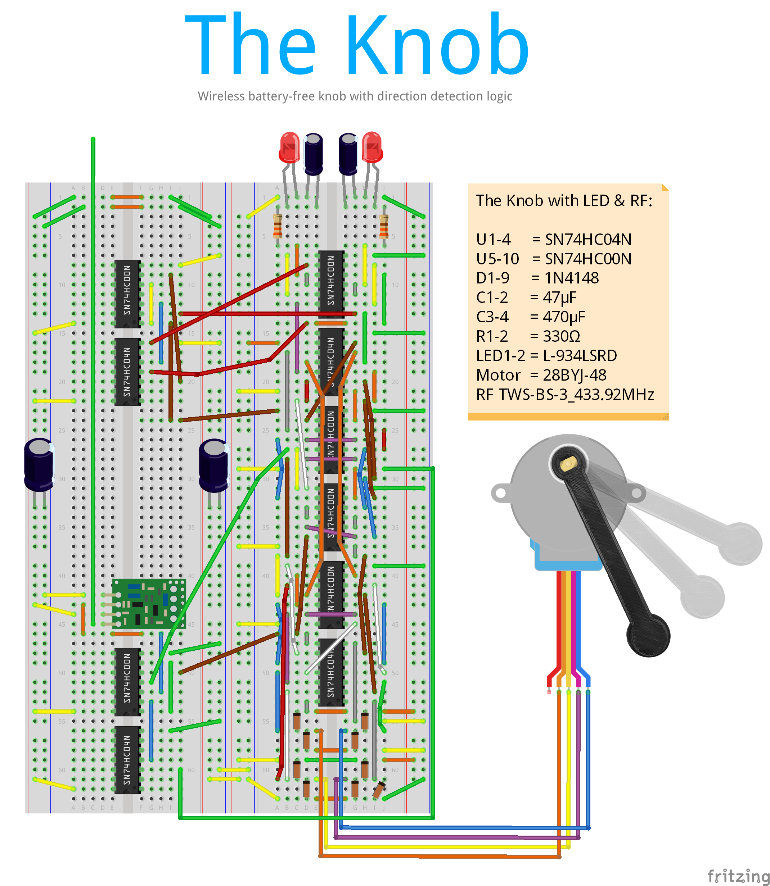
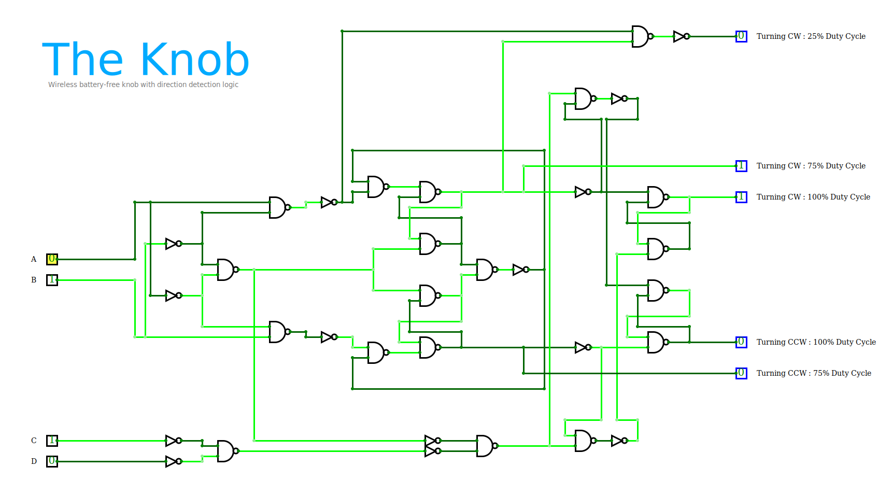
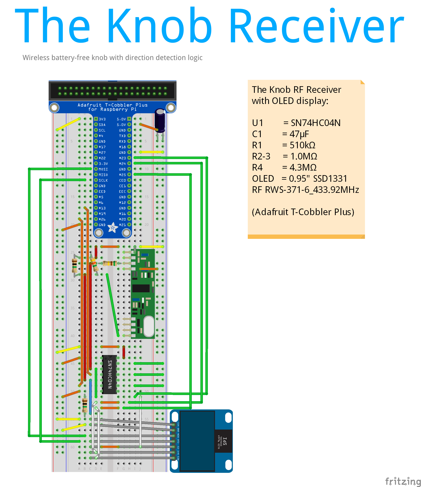

# The Knob with LED indicators and RF Transmitter v 1.0

## Description

A wireless knob that can transmit up to 10 meters the rotation direction and how many steps the handle has rotated (by sending one radio pulse per 4 motor steps). No battery, near instant reaction times and no programming required - pure analog and boolean logic circuitry. It takes < 10ms from the time the motor shaft starts rotating to the time the LED lights and the first FM signal pulse begins transmission.

> Demonstration video: https://www.youtube.com/watch?v=K2yqE7SBStU

## Mechanical components

1x Stepper Motor with large number of steps per revolution - the 28BYJ-48 used here requires **2048** steps for one full revolution.

1x Shaft handle for easier rotation by hand - 6cm long. The 28BYJ-48 has a 5mm diameter shaft with 1mm cuts on opposing sides. The handle 3D printed according to these specifications.

## Electrical components

All wires are from a 350-piece breadboard jumper set except the four wires connecting the breadboard to the motor. They are flexible M-M jumper wires.

The four-phase full bridge rectifier (D1-9) serves as the power source. While the motor shaft is rotating there will be enough current produced to power an LED as well as send a wireless signal carrying the direction of rotation and speed information.

Two 470µF (C3-4) capacitors stabilize the circuit voltage.

The four 6xNOT and six 4xNAND gates drive the digital boolean logic for detecting the direction of rotation, diverting power to the corresponding LED and generating the signal to be sent via the wireless transmitter. They are the all of the HC or High-speed CMOS family. This allows them to operate under very low Vcc (2-6V recommended operating conditions).

The RF module used is the TWS-BS-3 434MHz hobby transmitter able to work under very low supply voltages (rated at 1.5-12V).

One long wire (12.6cm - the longest from the 350-piece set) serves as the antenna for the transmitter.

Two 330Ω resistors limit the current to each of the LEDs.

The two 47µF capacitors near the LEDs absorb the current from single-pulse false positives when starting or stopping the rotation. When the stepper motor is halted or started in the middle of a 4-step cycle, the wrong direction can be detected for a duration of one cycle.

## Digital Logic

Built using CircuitVerse. The logic diagram is an almost exact copy of the physical version. The CW 25% and CCW 75% duty cycles are AND-ed using  U3 and U9 to generate the signal for RF transmitter. The CW 25%'s NAND is in U9, and there is no NOT afterwards since we are feeding it into a NAND gate that merges the two signals anyway. U3 is only used for inverting the CCW 75% duty cycle, before going into the merging gate on the U9.

## Source code

None needed.

# The Knob Receiver with OLED display v 1.0

## Description

A Raspberry Pi 2B based receiver for The Knob. A node.js script utilizing the pigpio library decodes the signal, while a python script renders the gauge on a 0.95" OLED display with a SPI interface.

## Electrical components

All wires are from a 350-piece breadboard jumper set.

One 47µF (C1) capacitor sits on the 5V rail for beauty.

The RF module used is the RWS-371-6_433.92MHz hobby receiver. It has both analog and digital data outputs. Due to the weak signal and external radio noise sources, the data output is very noisy, with frequent false positives. The analog output is instead split into three bands (low, noise, high) and used for detecting the rotation signals.

One long wire (12.6cm - the longest from the 350-piece set) serves as the antenna for the receiver.

Two of the four resistors - the second 1.0MΩ and the 4.3MΩ - are connected in parallel, thereby providing ~811kΩ resistance. This is then connected in series with the first resistor of 510kΩ and the other 1.0MΩ resistor so that we have two step-down voltages as follows:

Signal → 510kΩ → V1 → 1.0MΩ → V2 → 811kΩ → GND

## Digital Logic

By dividing the analog data output in two separate voltages and using a 6xNOT CMOS as a '1-bit ADC' the Raspberry PI's purely digital IO can now 'see' three values instead of just two. The following table illustrates how the analog input is transformed into separate voltage signals and then inverted through the NOT gates into digital signals.

| Analog          | V1        | V2        | D1   | D2   |
| --------------- | --------- | --------- | ---- | ---- |
| Low    `<` 1.0V | `<` 0.78V | `<` 0.35V | 3.3V | 3.3V |
| Noise `~` 2.5V  | `~` 1.95V | `~` 0.87V | 0V   | 3.3V |
| High   `>` 4.0V | `>` 3.12V | `>` 1.40V | 0V   | 0V   |

## Source code

The /src/knob folder contains the node.js signal decoder and a utility run.sh script.

The /src/lcd folder contains the python OLED 'gauge' renderer. It reads integer values from stdin and renders them on the display (currently as a progress bar).

The following steps show one way to install and run the code:

1. Enable SPI ('sudo raspi-config' → 'Interfacing Options' → 'P4 SPI' → 'Yes' → 'Finish' → 'sudo reboot now')
2. Copy the src folder into the /home/pi folder (without the src prefix).
3. cd ~/lcd
4. sudo apt-get install python-pip
5. sudo pip install spidev
6. wget https://gist.githubusercontent.com/TheRayTracer/dd12c498e3ecb9b8b47f/raw/70171d5648bf965632c9f229a2eadf3b44659661/SSD1331.py
7. cd ~/knob && npm install
8. chmod +x ./run.sh
9. ./run.sh

To make the receiver code run automatically after a reboot add '@reboot /home/pi/knob/run.sh' to the root crontab (sudo crontab -e)

